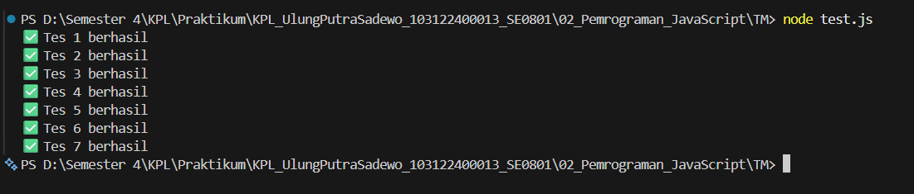

# Tugas Mandiri 02: Pemrograman JavaScript
## Soal  
Buatlah sebuah fungsi bernama fizzBuzz yang menerima input larik (array) dan mengembalikan deretan bilangan dan "Fizz" untuk kelipatan 2, "Buzz" untuk kelipatan 7, dan "FizzBuzz" untuk kelipatan 14.

## Kode Sumber
Tersedia di [tm.js](./tm.js)

## Output

## Deskripsi Program
Program ini menggunakan logika percabangan if-else untuk mengevaluasi setiap elemen dalam array:

Prioritas Pertama: Mengecek kelipatan 14 (angka % 14 === 0) untuk menghasilkan "FizzBuzz" agar tidak tertukar dengan kelipatan 2 atau 7 saja.

Kondisi Lain: Mengonversi angka menjadi "Fizz" jika habis dibagi 2 dan "Buzz" jika habis dibagi 7.

Penggabungan: Menggunakan operator penyambungan string untuk menggabungkan hasil evaluasi dengan spasi sebagai pemisah antar elemen.