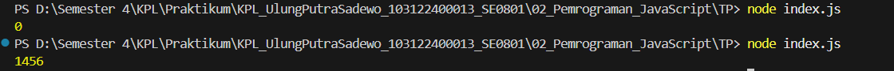

# Tugas Pendahuluan 02: Pemrograman JavaScript
## Soal  
Kamu sudah menulis fungsi mulOfArray. Ujilah dengan input [2, 0, 26, 28, -2], dengan output yang seharusnya adalah 1456. Jika kamu menemukan bahwa hasilnya berbeda, bisakah kamu memperbaikinya? Jika kamu menemukan bahwa hasilnya sama, bisakah kamu menjelaskan mengapa demikian?

## Jawaban 
Pertama Coba Hasilnya berbeda Yaitu **0**, Trus udah saya ganti dibagian if (arr[i] >= 0) menjadi 
(arr[i] > 0), Kenapa diganti karena di codenya hasilnya di kali dengan arr[i] jika masih make yg >= 0 maka hasil akan dikali dengan **0** dan hasil akhirnya jadi **0**, maka harus diubah menjadi > 0, agar hasilnya sesuai yaitu **1456**

## Kode Sumber
Tersedia di [index.js](./index.js)

## Output

## Deskripsi Program
Program ini menjalankan perkalian semua bilangan positif dalam larik (array). Ini akan bekerja untuk bilangan positif, nol, dan negatif.

Hasil awal adalah **0** karena angka 0 dalam array ikut dikalikan. Agar hasilnya menjadi **1456**, logika diperbaiki dengan mengubah kondisi menjadi `if (arr[i] > 0)` sehingga angka 0 dan negatif diabaikan.