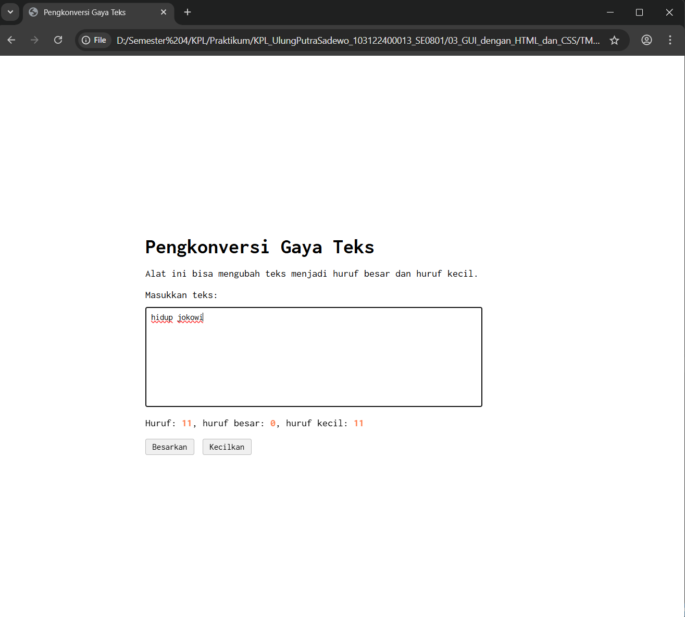
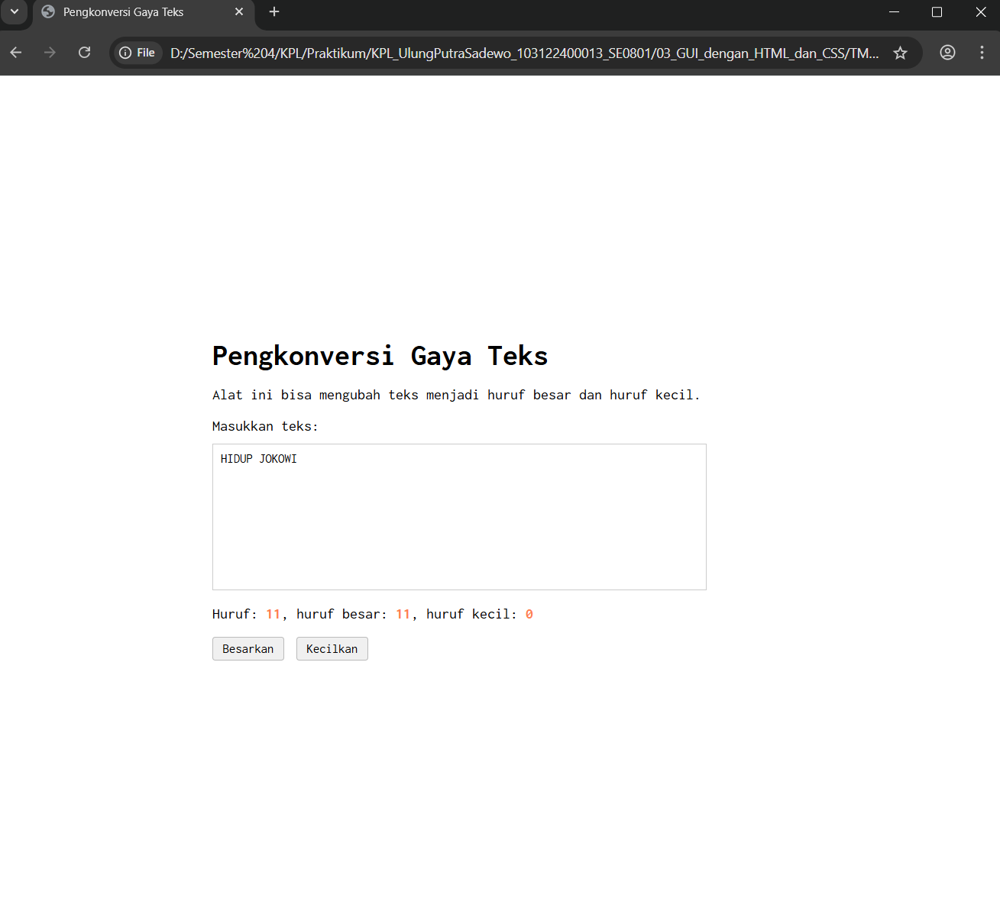

# Tugas Mandiri 03: GUI dengan HTML dan CSS

**Nama:** Ulung Putra Sadewo 
**NIM:** 103122400013  
**Kelas:** SE-08-01

## Tugas  
Setelah kamu menyelesaikan tugas pendahuluan, terapkanlah fungsi untuk (1) menghitung huruf kecil yang disediakan di #hk, (2) mengubah huruf kecil ke huruf besar ketika pengguna menekan tombol #huruf-besar, dan (3) mengubah huruf besar ke huruf kecil ketika pengguna menekan tombol #huruf-kecil

## Kode Sumber
Tersedia di [index.html](./index.html)
Tersedia di [index.css](./index.css)
Tersedia di [index.js](./index.js)

## Output

## Deskripsi Program
Program ini berfungsi untuk memproses dan mengubah gaya teks secara real-time, baik menjadi huruf besar, huruf kecil, maupun format paragraf yang rapi. Selain fitur konversi, alat ini juga secara otomatis menghitung total jumlah karakter serta merinci jumlah huruf besar dan huruf kecil yang diinputkan pengguna ke dalam kotak teks. Dengan tampilan antarmuka yang bersih menggunakan font Inconsolata dan tata letak yang presisi di tengah halaman, program ini memberikan pengalaman penggunaan yang fokus dan intuitif.