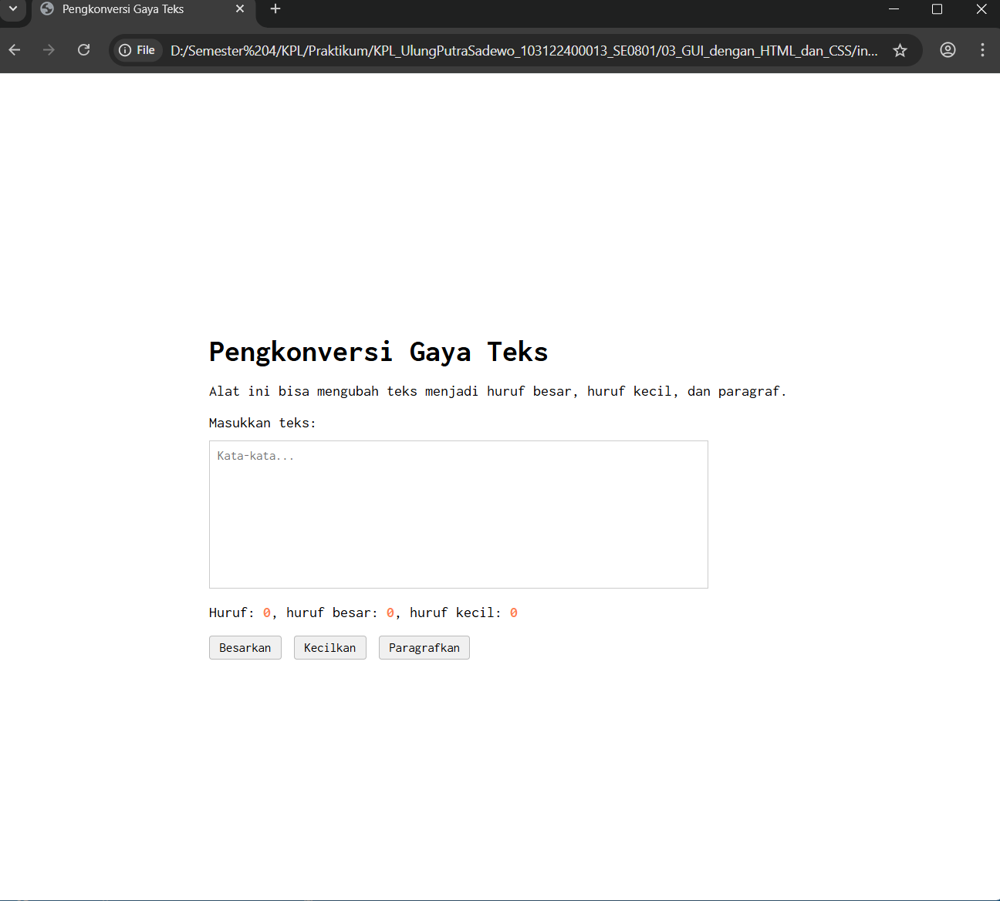

# Tugas Pendahuluan 03: GUI dengan HTML dan CSS
## Soal  
Buatlah tata letak laman yang kamu buat berada di tengah, dan juga ubah font-nya dengan Inconsolata dari Google Fonts.

## Kode Sumber
Tersedia di [index.html](./index.html)

## Output

## Deskripsi Program
Program ini berfungsi untuk memproses dan mengubah gaya teks secara real-time, baik menjadi huruf besar, huruf kecil, maupun format paragraf yang rapi. Selain fitur konversi, alat ini juga secara otomatis menghitung total jumlah karakter serta merinci jumlah huruf besar dan huruf kecil yang diinputkan pengguna ke dalam kotak teks. Dengan tampilan antarmuka yang bersih menggunakan font Inconsolata dan tata letak yang presisi di tengah halaman, program ini memberikan pengalaman penggunaan yang fokus dan intuitif.