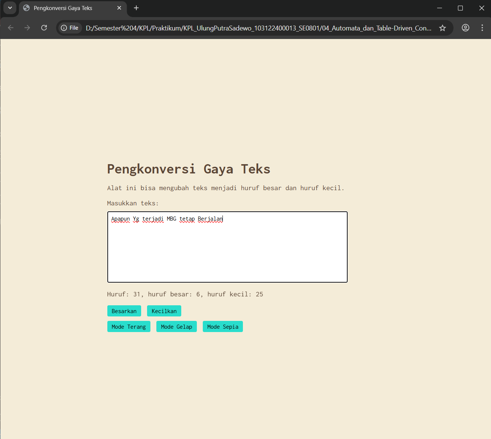

# Tugas Mandiri 04: Automata dan Table-Driven Construction

**Nama:** Ulung Putra Sadewo 
**NIM:** 103122400013  
**Kelas:** SE-08-01

## Tugas  
Tambahkan mode sepia dengan ketentuan:

Elemen	Warna
Latar belakang	#F4ECD8
Warna teks	#5B4636
Biarkan form tetap warna putih.

Ketentuan lainnya:

Bagian mode-div harus menaungi tiga button: light, dark, dan sepia
Bisa berpindah state secara mulus: sepia menghasilkan sepia-mode, dark menghasilkan dark-mode, dan light menghasilkan light-mode.

## Kode Sumber
Tersedia di [index.html](./index.html)
Tersedia di [index.css](./index.css)
Tersedia di [index.js](./index.js)

## Output

## Deskripsi Program
Program ini berfungsi untuk memproses dan mengubah gaya teks secara real-time, baik menjadi huruf besar, huruf kecil, maupun format paragraf yang rapi. Selain fitur konversi, alat ini juga secara otomatis menghitung total jumlah karakter serta merinci jumlah huruf besar dan huruf kecil yang diinputkan pengguna ke dalam kotak teks. Dengan tampilan antarmuka yang bersih dan bisa berubah tema gelap terang dan penambahan tema sepia serta menggunakan font Inconsolata dan tata letak yang presisi di tengah halaman, program ini memberikan pengalaman penggunaan yang fokus dan intuitif.