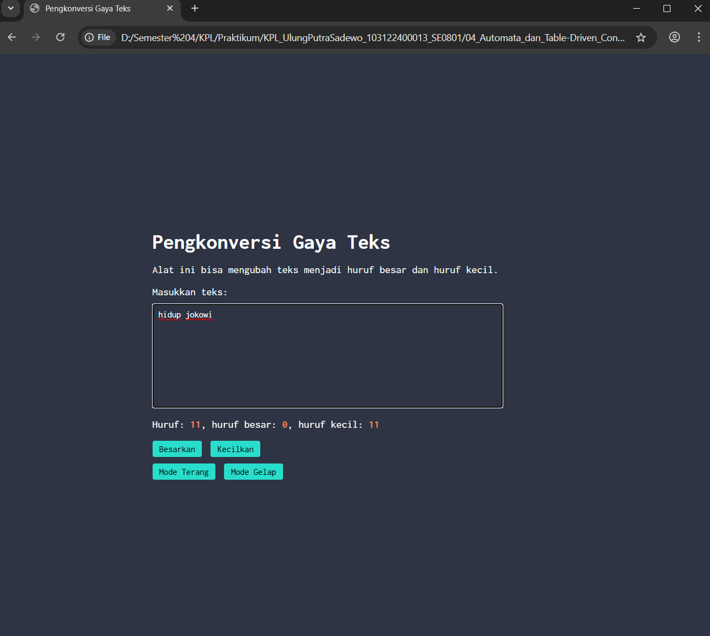
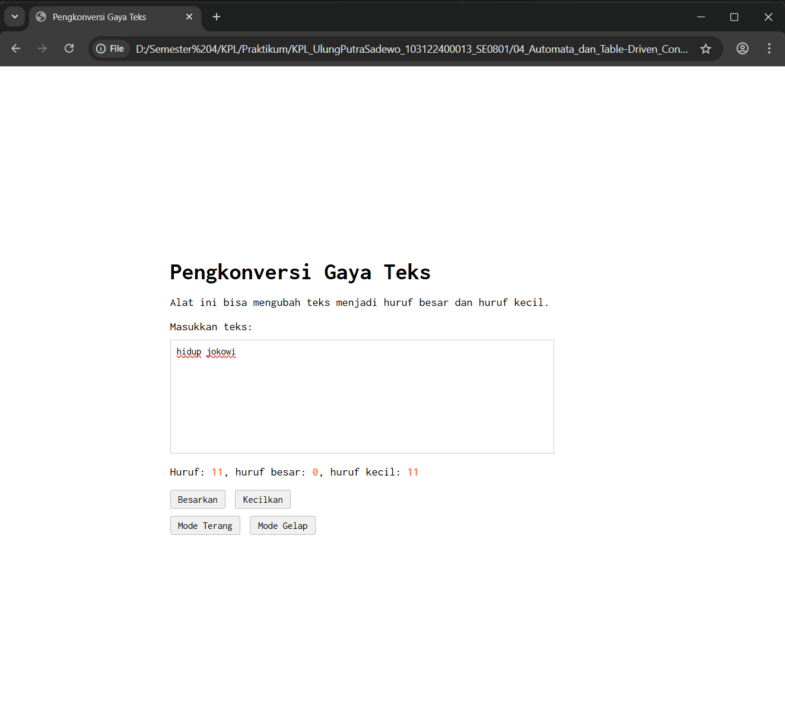

# Tugas Pendahuluan 04: Automata dan Table-Driven Construction

**Nama:** Ulung Putra Sadewo 
**NIM:** 103122400013  
**Kelas:** SE-08-01

## Tugas  
Tambahkan mode gelap sekaligus untuk editor-kecil dan tombol-tombolnya. Ketentuan warna untuk latar belakang editor-kecil adalah #2e3443, sementara untuk tombol adalah #29ddcc. Teks untuk tombol tetap mengikuti warna teks sebelumnya.

Untuk menghapus pinggiran tombol, nyatakan properti border untuk tidak ditunjukkan.

## Kode Sumber
Tersedia di [index.html](./index.html)
Tersedia di [index.css](./index.css)
Tersedia di [index.js](./index.js)

## Output

## Deskripsi Program
Program ini berfungsi untuk memproses dan mengubah gaya teks secara real-time, baik menjadi huruf besar, huruf kecil, maupun format paragraf yang rapi. Selain fitur konversi, alat ini juga secara otomatis menghitung total jumlah karakter serta merinci jumlah huruf besar dan huruf kecil yang diinputkan pengguna ke dalam kotak teks. Dengan tampilan antarmuka yang bersih dan bisa berubah tema gelap dan terang serta menggunakan font Inconsolata dan tata letak yang presisi di tengah halaman, program ini memberikan pengalaman penggunaan yang fokus dan intuitif.