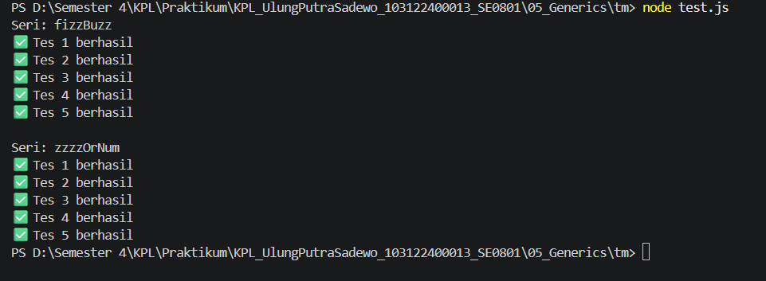

# Tugas Mandiri 05: Generics

**Nama:** Ulung Putra Sadewo 
**NIM:** 103122400013  
**Kelas:** SE-08-01

## Tugas
Membuat program index.js dengan Aturan FizzBuzz kali ini adalah:

Fungsi fizzBuzz hanya menerima larik yang semua elemennya terdiri dari bilangan bulat dan mengeluarkan larik pula yang bisa jadi bercampur string dan bilangan

Fungsi zzzzOrNum hanya menerima sebuah data tunggal berupa bilangan bulat dan mengembalikan "Fizz", "FizzBuzz", "Buzz", atau bilanga bulat sesuai logikanya

Kedua fungsi harus ada dan harus disertai JSDoc sesuai tipe data yang disiratkan dari no. 1, no. 2, dan perilaku yang diharapkan di bawah

fizzBuzz harus menggunakan fungsi zzzzOrNum di dalamnya

## Kode Sumber
Tersedia di [index.js](./index.js)
Tersedia di [test.js](./test.js)

## Output

## Deskripsi Program
Program ini adalah sebuah utilitas pemrosesan logika bilangan yang berfungsi untuk mentransformasi urutan angka berdasarkan aturan pembagian tertentu secara presisi. Program ini memiliki kemampuan untuk mengidentifikasi kelipatan angka 3, 5, atau keduanya (kelipatan 15) dari sebuah larik (array) maupun data tunggal, kemudian mengubahnya menjadi representasi teks yang sesuai ("Fizz", "Buzz", atau "FizzBuzz")