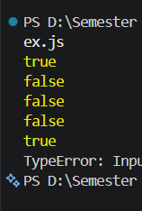

# Tugas Mandiri 06: Design By Contract Dan Defensive Programming

**Nama:** Ulung Putra Sadewo 
**NIM:** 103122400013  
**Kelas:** SE-08-01

## Kode Sumber
Tersedia di [index.js](./index.js)

## Output

## Deskripsi Program
Dalam tugas mandiri ini, saya mengimplementasikan prinsip Defensive Programming untuk memastikan fungsi memiliki ketahanan tinggi terhadap input yang tidak valid. Fokus utamanya adalah menyaring angka kelipatan Fizz Buzz dengan tetap menjaga integritas tipe data.

Strategi yang diterapkan meliputi:

Validasi Pre-kondisi: Menggunakan Number.isInteger() untuk menolak nilai null, NaN, atau Infinity melalui TypeError.

Logika Penyaringan: Memanfaatkan operator modulo untuk memvalidasi kelipatan 3 dan 5.

Manajemen Kesalahan: Menggunakan blok try-catch untuk menangani pengecualian (exception) tanpa menghentikan alur kerja program (preventing crash).