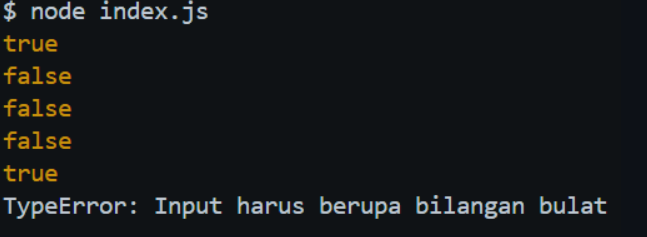

# Tugas Mandiri 06: Design by Contract dan Defensive Programming

**Nama:** Ulung Putra Sadewo 
**NIM:** 103122400013  
**Kelas:** SE-08-01

## Program/Kode

Tersedia di [index.js](./index.js)

## Output

Repositori ini berisi implementasi fungsi **is_not_fizzbuzz** menggunakan JavaScript

## 📝 Deskripsi Kode
Di tugas mandiri kali ini, aku nerapin konsep *Defensive Programming* buat bikin fungsi yang "tahan banting" dari input yang nggak sesuai. Fokus utamanya adalah memfilter angka-angka kelipatan *fizz buzz* sambil tetap menjaga integritas tipe data yang masuk.

Beberapa poin penting yang aku terapin di kode ini:
1. **Validasi Ketat (Pre-condition):** Aku pakai `Number.isInteger()` buat mastiin inputnya beneran angka bulat. Kalau dikasih `null`, `NaN`, atau `Infinity`, program bakal langsung nge-lempar `TypeError`. Ini penting supaya fungsi nggak memproses data sampah.
2. **Logika Penyaringan:** Fungsi bakal balikin nilai `false` kalau angka yang dimasukkan itu kelipatan 3, 5, atau 15 (pake operator modulo `%`). Sebaliknya, kalau angkanya aman dari kelipatan itu, fungsi bakal balikin `true`.
3. **Error Handling:** Aku bungkus pemanggilan fungsinya pakai blok `try-catch`. Tujuannya biar pas ada *error* dari input yang salah, program nggak langsung *crash*, tapi malah ngasih pesan error yang jelas di konsol.

Simpelnya, kode ini dirancang supaya bisa nolak input yang aneh-aneh sebelum masuk ke logika utama.