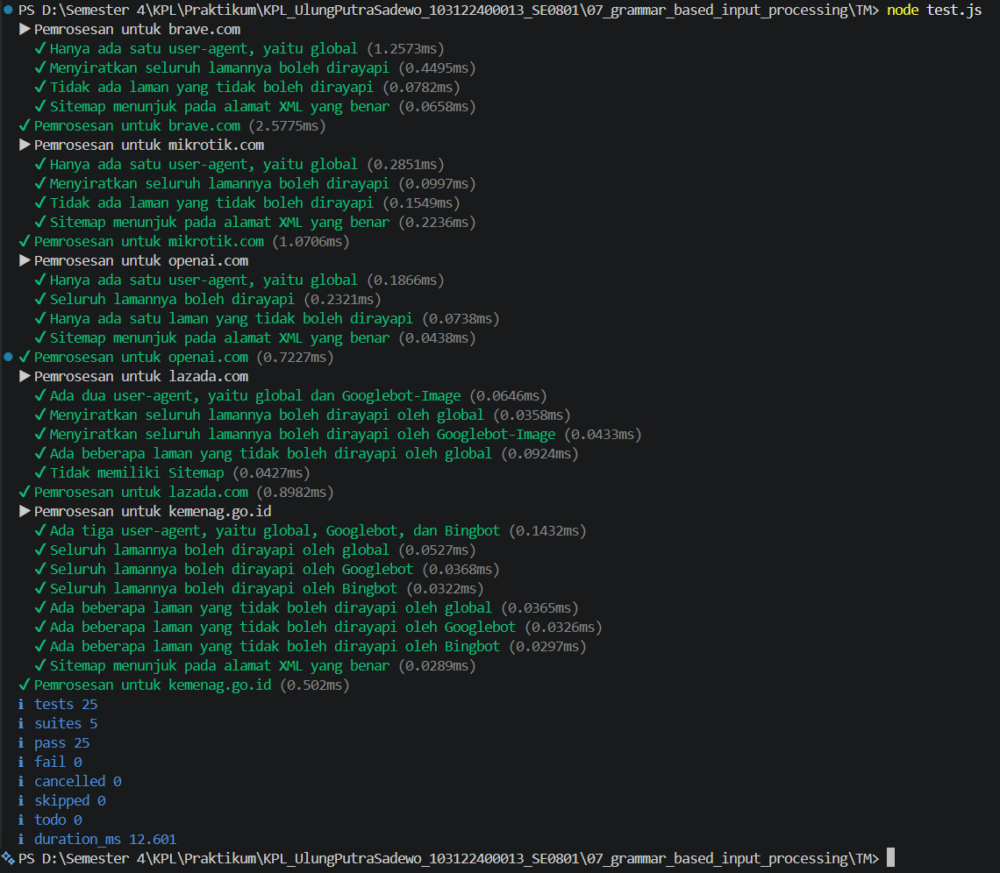

# Tugas Mandiri 07: Grammar-based Input Processing

**Nama:** Ulung Putra Sadewo 
**NIM:** 103122400013  
**Kelas:** SE-08-01

## Tugas
Tugas pada kesempatan kali ini adalah membuat fungsi yang menguraikan isi robots.txt menjadi POJO (plain old JavaScript object). Empat properti yang perlu diuraikan dijabarkan di bawah berikut.

User-agent adalah nama robot perayapnya
Allow adalah daftar halaman-halaman yang boleh dirayap
Disallow adalah daftar halaman-halaman yang tidak boleh dirayap
Sitemap adalah sebuah pranala yang menunjuk pada "denah" situs web (biasanya berformat XML)

## Kode Sumber
Tersedia di [index.js](./index.js)
Tersedia di [test.js] (./test.js)
Tersedia di [structure.d.ts](./structure.d.ts)

## Output

## Deskripsi Program
Dalam tugas mandiri ini, saya mengimplementasikan teknik Text Processing dan State Management untuk menguraikan berkas konfigurasi robots.txt menjadi sebuah Plain Old JavaScript Object (POJO). Fokus utamanya adalah menjaga akurasi pemetaan aturan akses robot perayap (crawler) dari berbagai format teks mentah.