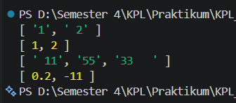

# Tugas Pendahuluan 07: Grammar Based Input Processing

**Nama:** Ulung Putra Sadewo 
**NIM:** 103122400013  
**Kelas:** SE-08-01

## Kode Sumber
Tersedia di [index.js](./index.js)

## Output

## Deskripsi Program
Program ini adalah sebuah utilitas pemrosesan teks yang berfungsi untuk menghitung jumlah karakter secara presisi berdasarkan kategori tertentu. Program ini memiliki kemampuan untuk membedakan antara penghitungan total karakter secara keseluruhan (termasuk spasi) dan penghitungan yang hanya berfokus pada jumlah huruf saja (mengabaikan spasi).

Dengan menggunakan fungsi logika yang efisien, alat ini memungkinkan pengguna untuk mendapatkan data statistik teks yang akurat secara instan. Dibangun dengan struktur kode yang bersih dan dokumentasi JSDoc yang jelas, program ini memberikan kemudahan bagi pengembang untuk mengintegrasikan fitur analisis teks ke dalam aplikasi yang lebih besar, memastikan pengalaman pengolahan data string yang fokus dan intuitif.