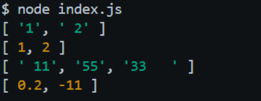

# Tugas Pendahuluan 07: Grammar-based Input Processing

**Nama:** Ulung Putra Sadewo 
**NIM:** 103122400013  
**Kelas:** SE-08-01

## Program/Kode

Tersedia di [index.js](./index.js)

## Output

Repositori ini berisi implementasi fungsi **Grammar-based Input Processing** pakai JavaScript buat menuntaskan tugas Praktikum Konstruksi Perangkat Lunak (KPL) Modul 7.

## 📝 Deskripsi Kode

Di modul ini, fokus utamanya adalah gimana cara kita melakukan _parsing_ atau pengolahan input teks supaya bisa jadi struktur data yang kita mau. Di sini aku bikin fungsi `toNumberArray` yang tugasnya mengubah deretan string jadi array berisi angka.

Logika yang aku terapkan di kode ini simpel tapi efektif, ngikutin materi di Modul 7:

1. **Pecah String:** Pakai metode `.split(',')` buat memisahkan angka-angka yang awalnya digabung dalam satu string.
2. **Bersihin Data:** Biar nggak error pas konversi, aku pakai `.trim()` buat hapus spasi nggak jelas di depan atau belakang teks.
3. **Filtering:** Terakhir, aku tambahin pengecekan pakai `isNaN`. Jadi kalau ada input yang "nyasar" (bukan angka, kayak tulisan 'abc'), fungsi ini bakal otomatis nge-skip dan cuma ngambil angka yang valid aja.

Tujuannya supaya program tetap stabil meskipun dikasih input yang formatnya berantakan atau nggak konsisten.