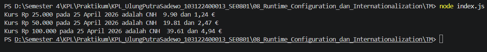

# Tugas Mandiri 08: Runtime Configuration dan Internationalization

**Nama:** Ulung Putra Sadewo 
**NIM:** 103122400013  
**Kelas:** SE-08-01

## Tugas
membuat program yang menampilkan kurs rupiah (IDR) terhadap renminbi luar Tiongkok (CNH) dan euro (EUR)

## Kode Sumber
Tersedia di [index.js](./index.js)

## Output

## Deskripsi Program
Dalam tugas mandiri ini, saya mengimplementasikan teknik Text Processing dan State Management untuk menguraikan berkas konfigurasi robots.txt menjadi sebuah Plain Old JavaScript Object (POJO). Fokus utamanya adalah menjaga akurasi pemetaan aturan akses robot perayap (crawler) dari berbagai format teks mentah.