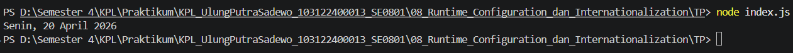

# Tugas Pendahuluan 08: Runtime Configuration dan Internationalization

**Nama:** Ulung Putra Sadewo 
**NIM:** 103122400013  
**Kelas:** SE-08-01

## Kode Sumber
Tersedia di [index.js](./index.js)

## Output

## Deskripsi Program
Dalam tugas pendahuluan ini, saya mengimplementasikan standardisasi internasional untuk pemformatan waktu menggunakan Internationalization API (Intl) di JavaScript. Tujuannya adalah untuk menghasilkan representasi tanggal yang adaptif terhadap lokalitas tertentu tanpa melakukan manipulasi string manual yang rentan kesalahan.