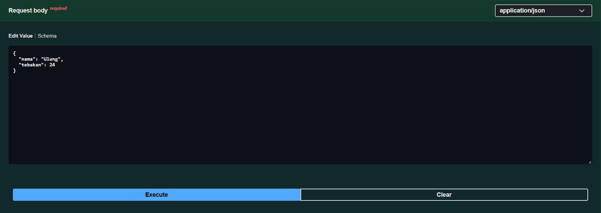
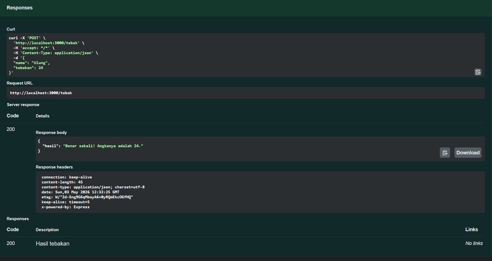
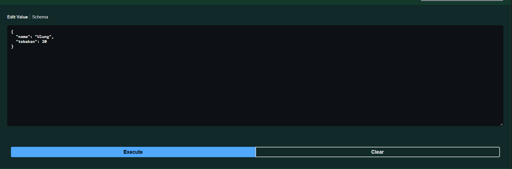
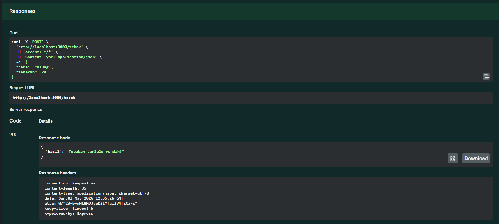

# Tugas Mandiri 09: API Design dan Construction Using Swagger

**Nama:** Ulung Putra Sadewo  
**NIM:** 103122400013  
**Kelas:** SE-08-01

## Program/Kode

Tersedia di [index.js](./index.js) dan [swagger.js](./swagger.js)

## Output

## 📝 Jawaban Tugas Mandiri

Pada Tugas Mandiri kali ini, fokus utamanya adalah membangun RESTful API menggunakan Express.js yang dilengkapi dengan dokumentasi interaktif menggunakan Swagger (OpenAPI 3.0) serta mengimplementasikan logika deterministik sederhana.

### Implementasi Logika Tebak Angka Deterministik
Berdasarkan aturan yang diberikan, angka yang ditebak harus tetap (konsisten) untuk nama yang sama namun tetap sensitif terhadap besar kecil huruf. Saya mengimplementasikan ini dengan:
1. **ASCII Summation:** Menggunakan `charCodeAt()` untuk menjumlahkan nilai ASCII dari setiap karakter dalam string `nama`. Karena karakter 'h' dan 'H' memiliki nilai ASCII berbeda, aturan *case-sensitivity* terpenuhi secara alami.
2. **Modulo Operation:** Menggunakan operasi `% 100` untuk membatasi hasil penjumlahan ke rentang 0-99, kemudian ditambahkan `1` untuk menggeser rentang menjadi **1-100** sesuai spesifikasi.

### Dokumentasi API dengan Swagger
Untuk mempermudah pengujian dan integrasi, saya menggunakan `swagger-jsdoc` dan `swagger-ui-express`:
* **Integrasi JSDoc:** Dokumentasi didefinisikan langsung di atas setiap *route* menggunakan komentar JSDoc, sehingga metadata API tersimpan bersama kodenya.
* **Request Validation:** Mendefinisikan `requestBody` dengan skema objek yang membutuhkan properti `nama` (string) dan `tebakan` (integer), memudahkan pengguna API mengetahui format input yang benar melalui endpoint `/docs`.

### Penanganan Request Body (Middleware)
Agar server dapat membaca data JSON yang dikirim oleh client (seperti dari Thunder Client atau Swagger UI), saya menggunakan middleware bawaan Express yaitu `app.use(express.json())`. Tanpa middleware ini, `req.body` akan bernilai `undefined` dan menyebabkan error saat mencoba melakukan destrukturisasi properti `nama` dan `tebakan`.