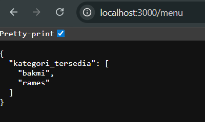
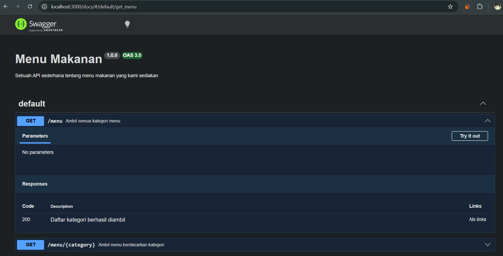

# Tugas Pendahuluan 09: API Design dan Construction Using Swagger

**Nama:** Ulung Putra Sadewo 
**NIM:** 103122400013  
**Kelas:** SE-08-01

## Tugas
Buatlah satu endpoint lagi beserta dokumentasi OpenAPI-nya, yaitu GET /menu yang menampilkan daftar semua nama kategori menu yang ada.

## Kode Sumber
Tersedia di [index.js](./index.js)
Tersedia di [swagger.js](./swagger.js)

## Output

## Deskripsi Program
Dalam tugas pendahuluan ini, saya mengimplementasikan dokumentasi API yang terstandardisasi menggunakan spesifikasi OpenAPI 3.0 melalui library Swagger JSDoc dan Swagger UI Express. Tujuannya adalah untuk menyediakan antarmuka dokumentasi yang interaktif dan terstruktur bagi endpoint manajemen menu, sehingga mempermudah proses pengujian (testing) dan integrasi API tanpa memerlukan dokumentasi eksternal manual yang statis.