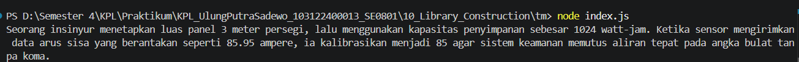

# Tugas Mandiri: Library Construction

**Nama:** Ulung Putra Sadewo 
**NIM:** 103122400013  
**Kelas:** SE-08-01

## Program/Kode

Tersedia di [index.js](./index.js), [bulat.js](./mtk-gampang/lib/bulat.js), [kuadrat.js](./mtk-gampang/lib/kuadrat.js), [pangkat.js](./mtk-gampang/lib/pangkat.js)

## Output

## 📝 Jawaban Tugas Pendahuluan

Pada Tugas Pendahuluan kali ini, fokus utamanya adalah membangun sebuah pustaka (*library*) matematika sederhana menggunakan JavaScript modern (ESM).

### Implementasi Library Construction
Dalam pembuatan pustaka ini, saya menerapkan prinsip modularitas dengan memisahkan fungsi-fungsi matematika ke dalam folder `lib/`. Setiap berkas di dalam folder `lib` hanya bertanggung jawab atas satu fungsi (Single Responsibility):

1.  **`pangkat.js`**: Berisi fungsi `pangkat(x, y)` untuk menghitung hasil eksponen dari nilai x pangkat y.
2.  **`bulat.js`**: Berisi fungsi `bulat(x)` yang menggunakan logika matematika untuk mengubah bilangan non-bulat (desimal) menjadi bilangan bulat (misalnya -4.25 menjadi -4).
3.  **`kuadrat.js`**: Berisi fungsi `kuadrat(x)` yang berfungsi untuk mengembalikan nilai akar kuadrat (square root) dari x.

### Pola Ekspor Impor (ES Modules)
Sesuai dengan materi Modul 10 dan batasan tugas, pustaka ini menggunakan standar **ESM (ECMAScript Modules)** dengan mekanisme akses terpusat:
* **Pola Akses Terpusat**: Meskipun logika fungsi berada di dalam folder `lib`, akses utama dibatasi hanya melalui berkas `index.js`. Hal ini dilakukan dengan mengimpor semua fungsi ke `index.js` dan mengekspornya kembali sebagai properti dari satu objek utama.
* **Local Installation**: Pustaka ini dirancang untuk dapat diinstal secara lokal, memungkinkan pengembang lain menggunakan fungsi `kuadrat`, `pangkat`, dan `bulat` melalui satu gerbang masuk modul yang rapi.

### Analisis Struktur Pustaka
Dalam konteks *Library Construction*, struktur folder yang rapi sangat krusial. Proyek ini memisahkan antara entri utama (`index.js`), konfigurasi proyek (`package.json`), dan repositori fungsi (`lib/`). Penggunaan konfigurasi `"type": "module"` pada `package.json` memastikan Node.js menjalankan pustaka ini menggunakan standar modul modern, yang mendukung fitur *tree-shaking* dan modularitas yang lebih baik dibandingkan CommonJS.