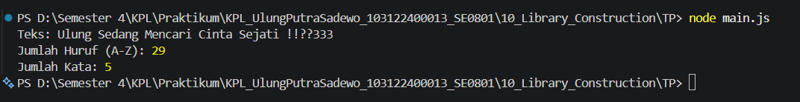

# Tugas Pendahuluan 10: Library Construction

**Nama:** Ulung Putra Sadewo 
**NIM:** 103122400013  
**Kelas:** SE-08-01

## Tugas
Buatlah pustaka JavaScript yang menyediakan utilitas berupa dua fungsi yang menghitung jumlah huruf dan jumlah kata.

Kriteria:

Hanya alfabet A hingga Z yang dihitung (besar dan kecil)
Spasi tidak dihitung sebagai huruf
Pustaka dapat diimpor ke file lain

## Kode Sumber
Tersedia di [index.js](./index.js)
Tersedia di [main.js](./main.js)

## Output

## Deskripsi Program
Program ini merupakan sebuah library sederhana yang berisi dua fungsi utama, yaitu untuk menghitung jumlah huruf dan jumlah kata dari sebuah teks.

Fungsi countLetters digunakan untuk menghitung jumlah huruf dengan cara menghapus semua karakter selain alfabet. Fungsi countWords digunakan untuk menghitung jumlah kata dengan cara memisahkan teks berdasarkan spasi, lalu memfilter hanya kata yang valid (berisi huruf saja).

Library ini dibuat agar dapat digunakan kembali (reusable) dengan cara di-import ke file lain.