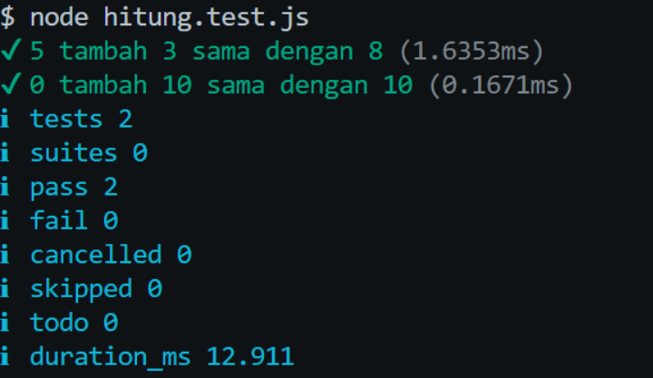

# Tugas Mandiri: Performance Analysis, Unit Testing, dan Debugging

**Nama:** Ulung Putra Sadewo
**NIM:** 103122400013
**Kelas:** SE-08-01

## Program/Kode

tersedia di [hitung.js](./hitung.js) dan [hitung.test.js](./hitung.test.js)

## Output



## 📝 Jawaban Tugas Mandiri

Pada Tugas Mandiri Modul 12 kali ini, fokus utamanya adalah menelaah kesesuaian antara program utama dan file _unit testing_ menggunakan API pengujian bawaan Node.js, serta melakukan _debugging_ terhadap kelengkapan struktur modul (_import/export_).

### 1. Analisis Bug dan Solusi Pemecahan Masalah

Berdasarkan kode yang diberikan pada soal Tugas Mandiri, kode tersebut **belum sepenuhnya benar** dan akan mengalami kegagalan (_error_) ketika _unit test_ dijalankan menggunakan perintah `node --test`.

- **Permasalahan (Bug):** Pada file `hitung.test.js`, program mencoba mengimpor fungsi dengan metode ES Modules (ESM) menggunakan perintah `import { tambahPengitung } from './hitung.js';`. Namun, pada file `hitung.js`, fungsi `tambahPengitung` hanya dideklarasikan secara lokal saja dan **tidak diekspor**. Hal ini akan memicu error pada Node.js (seperti _"The requested module does not provide an export named..."_) karena `hitung.test.js` tidak dapat menemukan fungsi tersebut di dalam `hitung.js`.

- **Solusi Penanganan (Fix):** Masalah ini diselesaikan dengan menambahkan _keyword_ `export` di depan deklarasi fungsi pada file `hitung.js` agar fungsi tersebut terekspos dan dapat diakses oleh file di luarnya.

  **Perbaikan pada `hitung.js`:**

  ```javascript
  export function tambahPengitung(terkini, jumlah) {
    terkini = terkini + jumlah;
    return terkini;
  }
  ```