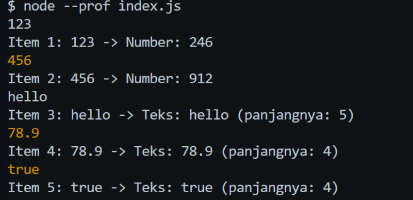

# Tugas Pendahuluan: Performance Analysis, Unit Testing, dan Debugging

**Nama:** Ulung Putra Sadewo
**NIM:** 103122400013
**Kelas:** SE-08-01

## Program/Kode

Tersedia di [index.js](./index.js)

## Output



## 📝 Jawaban Tugas Pendahuluan

Pada Tugas Pendahuluan Modul 12 kali ini, fokus utamanya adalah melakukan analisis kode, _debugging_ terhadap kecacatan program (_runtime error_), serta memahami alur eksekusi pemrosesan tipe data dinamis pada JavaScript.

### 1. Analisis Bug dan Solusi Pemecahan Masalah

Pada kode awal yang disediakan di dalam panduan praktikum, terdapat sebuah kecacatan (_bug_) yang menyebabkan program mengalami kegagalan eksekusi (_crash_).

- **Permasalahan (Bug):** Program asli menggunakan fungsi `const str = data.toLowerCase();` di dalam fungsi `processData`. Karena array pada fungsi `main` memiliki tipe data campuran (_dynamic types_) seperti `Number` dan `Boolean`, program langsung berhenti dan mengeluarkan error `TypeError: data.toLowerCase is not a function` ketika mencapai elemen non-string (seperti angka `456`). Method `.toLowerCase()` hanya tersedia untuk tipe data `String`.
- **Solusi Penanganan (Fix):** Masalah ini diselesaikan dengan menerapkan teknik _defensive programming_, yaitu menambahkan method `.toString()` sebelum melakukan manipulasi teks:
  ```javascript
  const str = data.toString().toLowerCase();
  ```